# Career OS ER Diagram

MySQL 8.0用スキーマのER図です。`PK`は主キー、`FK`は外部キー、`UK`はユニークキーを表します。

```mermaid
erDiagram
    USERS {
        BIGINT user_id PK
        VARCHAR email UK
        VARCHAR password_hash
        DATETIME created_at
        DATETIME updated_at
    }

    STATUSES {
        BIGINT status_id PK
        BIGINT user_id FK
        VARCHAR name
        INT sort_order
    }

    INDUSTRIES {
        BIGINT industry_id PK
        BIGINT user_id FK
        VARCHAR name
        INT sort_order
    }

    JOB_CATEGORIES {
        BIGINT job_category_id PK
        BIGINT user_id FK
        VARCHAR name
        INT sort_order
    }

    INTEREST_LEVELS {
        BIGINT interest_level_id PK
        BIGINT user_id FK
        VARCHAR name
        INT sort_order
    }

    APPLICATION_SOURCES {
        BIGINT source_id PK
        BIGINT user_id FK
        VARCHAR name
        INT sort_order
    }

    AGENTS {
        BIGINT agent_id PK
        BIGINT user_id FK
        VARCHAR name
        VARCHAR email
        VARCHAR phone
        TEXT memo
    }

    COMPANIES {
        BIGINT company_id PK
        BIGINT user_id FK
        BIGINT industry_id FK
        VARCHAR name
        VARCHAR corporate_url
        TEXT business
        TEXT memo
        BOOLEAN archived
    }

    APPLICATIONS {
        BIGINT application_id PK
        BIGINT user_id FK
        BIGINT company_id FK
        BIGINT job_category_id FK
        BIGINT interest_level_id FK
        BIGINT status_id FK
        BIGINT source_id FK
        BIGINT agent_id FK
        VARCHAR title
        VARCHAR mypage_url
        TEXT motivation
        VARCHAR next_action
        DATETIME deadline_at
        BOOLEAN rejected
    }

    FLOW_TEMPLATES {
        BIGINT template_id PK
        BIGINT user_id FK
        VARCHAR name
    }

    FLOW_TEMPLATE_STEPS {
        BIGINT template_step_id PK
        BIGINT template_id FK
        VARCHAR title
        VARCHAR step_type
        INT sort_order
    }

    FLOW_STEPS {
        BIGINT step_id PK
        BIGINT user_id FK
        BIGINT application_id FK
        VARCHAR title
        VARCHAR step_type
        ENUM status
        INT sort_order
        DATETIME scheduled_at
        DATETIME deadline_at
        VARCHAR url
        TEXT memo
    }

    EVENTS {
        BIGINT event_id PK
        BIGINT user_id FK
        BIGINT company_id FK
        BIGINT application_id FK
        BIGINT agent_id FK
        BIGINT step_id FK
        VARCHAR event_type
        ENUM schedule_status
        VARCHAR title
        DATETIME start_at
        DATETIME end_at
        ENUM state
    }

    TASKS {
        BIGINT task_id PK
        BIGINT user_id FK
        BIGINT company_id FK
        BIGINT application_id FK
        BIGINT step_id FK
        VARCHAR title
        DATETIME due_at
        BOOLEAN done
        BOOLEAN hidden
    }

    NOTES {
        BIGINT note_id PK
        BIGINT user_id FK
        BIGINT company_id FK
        BIGINT application_id FK
        BIGINT agent_id FK
        VARCHAR category
        VARCHAR title
        LONGTEXT body
    }

    CONTENTS {
        BIGINT content_id PK
        BIGINT user_id FK
        BIGINT company_id FK
        BIGINT application_id FK
        ENUM category
        VARCHAR title
        LONGTEXT body
        BOOLEAN interview_visible
        INT sort_order
    }

    INTERVIEW_DRAFTS {
        BIGINT draft_id PK
        BIGINT user_id FK
        BIGINT company_id FK
        BIGINT application_id FK
        VARCHAR draft_scope UK
        VARCHAR title
        LONGTEXT body
        DATETIME started_at
    }

    INTERVIEW_LOGS {
        BIGINT log_id PK
        BIGINT user_id FK
        BIGINT company_id FK
        BIGINT application_id FK
        VARCHAR title
        LONGTEXT body
        DATETIME occurred_at
    }

    RESOURCES {
        BIGINT resource_id PK
        BIGINT user_id FK
        BIGINT company_id FK
        BIGINT application_id FK
        ENUM resource_type
        VARCHAR category
        VARCHAR display_name
        VARCHAR stored_name
        BIGINT size_bytes
        VARCHAR external_url
    }

    LEGACY_RECORDS {
        BIGINT legacy_id PK
        BIGINT user_id FK
        VARCHAR source_table
        VARCHAR source_id
        JSON payload
        DATETIME imported_at
    }

    SCHEMA_MIGRATIONS {
        VARCHAR version PK
        DATETIME applied_at
    }

    USERS ||--o{ STATUSES : owns
    USERS ||--o{ INDUSTRIES : owns
    USERS ||--o{ JOB_CATEGORIES : owns
    USERS ||--o{ INTEREST_LEVELS : owns
    USERS ||--o{ APPLICATION_SOURCES : owns
    USERS ||--o{ AGENTS : owns
    USERS ||--o{ COMPANIES : owns
    USERS ||--o{ APPLICATIONS : owns
    USERS ||--o{ FLOW_TEMPLATES : owns
    USERS ||--o{ FLOW_STEPS : owns
    USERS ||--o{ EVENTS : owns
    USERS ||--o{ TASKS : owns
    USERS ||--o{ NOTES : owns
    USERS ||--o{ CONTENTS : owns
    USERS ||--o{ INTERVIEW_DRAFTS : owns
    USERS ||--o{ INTERVIEW_LOGS : owns
    USERS ||--o{ RESOURCES : owns
    USERS o|--o{ LEGACY_RECORDS : owns

    INDUSTRIES o|--o{ COMPANIES : classifies
    COMPANIES ||--o{ APPLICATIONS : has
    JOB_CATEGORIES o|--o{ APPLICATIONS : classifies
    INTEREST_LEVELS o|--o{ APPLICATIONS : prioritizes
    STATUSES o|--o{ APPLICATIONS : tracks
    APPLICATION_SOURCES o|--o{ APPLICATIONS : sources
    AGENTS o|--o{ APPLICATIONS : supports

    FLOW_TEMPLATES ||--o{ FLOW_TEMPLATE_STEPS : contains
    APPLICATIONS ||--o{ FLOW_STEPS : contains

    COMPANIES o|--o{ EVENTS : relates
    APPLICATIONS o|--o{ EVENTS : relates
    AGENTS o|--o{ EVENTS : relates
    FLOW_STEPS o|--o{ EVENTS : schedules

    COMPANIES o|--o{ TASKS : relates
    APPLICATIONS o|--o{ TASKS : relates
    FLOW_STEPS o|--o{ TASKS : relates

    COMPANIES o|--o{ NOTES : relates
    APPLICATIONS o|--o{ NOTES : relates
    AGENTS o|--o{ NOTES : relates

    COMPANIES o|--o{ CONTENTS : scopes
    APPLICATIONS o|--o{ CONTENTS : scopes

    COMPANIES o|--o{ INTERVIEW_DRAFTS : scopes
    APPLICATIONS o|--o{ INTERVIEW_DRAFTS : scopes
    COMPANIES o|--o{ INTERVIEW_LOGS : records
    APPLICATIONS o|--o{ INTERVIEW_LOGS : records

    COMPANIES o|--o{ RESOURCES : owns
    APPLICATIONS o|--o{ RESOURCES : owns
```

## 中心となるデータ構造

1. `users`配下に、ユーザー固有の企業・マスタ・予定・メモなどを保持します。
2. `companies`は企業情報、`applications`は同じ企業への複数応募案件を表します。
3. `flow_steps`、`events`、`tasks`は応募案件や企業へ紐付けて選考と予定を管理します。
4. `contents`は面接用カンペ、`interview_drafts`と`interview_logs`は面接中メモと確定ログを保持します。
5. `resources`は文章ファイルまたは外部共有リンクのメタデータを保持します。

## 削除ルール

- ユーザー削除時は、ユーザーが所有するデータを`ON DELETE CASCADE`で削除します。
- 企業削除時は、応募案件と企業直属データを`ON DELETE CASCADE`で削除します。
- 任意関連のマスタ、担当者、選考ステップを削除した場合は、対象FKを`ON DELETE SET NULL`にします。

